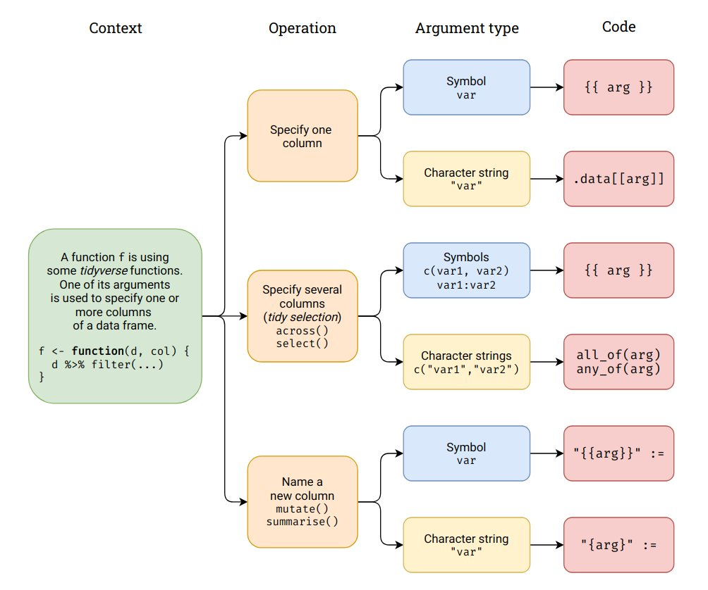

# Portland R Meetup: intro to the tidy-eval framework.

## Intro

John Smith and Brittany Barker (Aggregate co-organizers) will give a brief demonstration on tidy evaluation. Tidy evaluation (selection) provides a concise dialect of R for selecting variables based on their names or properties. We'll cover some example operations such as using tidy selection to select columns by name, position, or type, and to summarise a column or data frame.

References:

-   [Tidy-select page](https://dplyr.tidyverse.org/reference/dplyr_tidy_select.html)

-   [Programming with dplyr](https://dplyr.tidyverse.org/articles/programming.html)

We are taking inspiration from this diagram:

## Basics

We aim to provide an example of using a symbol and a character string to

-   Specify one column
-   Specify several columns
-   Name a new column in mutate or summarise

## Extensions

The beauty of the tidyselect framework is that it can be used in other `tidyverse` packages, like `ggplot` or `gt`

### ggplot

### gt
