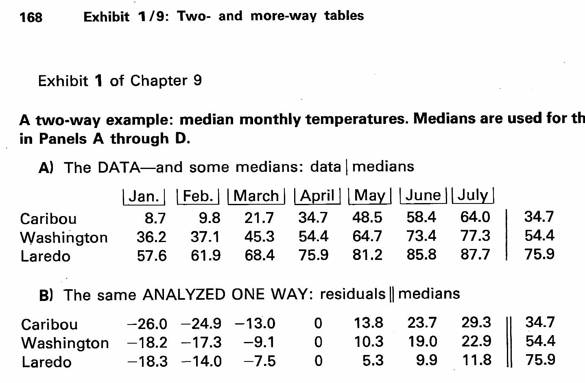

## Libraries

```{r setup, include=FALSE}
source("/Users/jds/Documents/Library/R/mpx/R/mp_fit.R")
source("/Users/jds/Documents/Library/R/mpx/R/mp_plot.R")
source("/Users/jds/Documents/Library/R/mpx/R/mp_rotate_plot.R")

library(tidyverse)
library(grid)
library(ggplotify)
library(cowplot)
library(mpx)
theme_set(theme_light())
```

## First steps of a worked example

p 168 from Mosteller and Tukey, *Data Analysis and Regression, A Second Course in Statistics*, Reading, MA: Addison-Wesley, 1977.



## Median temperature data

Set up the data in R

```{r}
med_temp_tibble <- tibble(
  month = c("Jan", "Feb", "Mar", "Apr", "May", "Jun", "Jul"),
  Caribou = c(8.7, 9.8, 21.7, 34.7, 48.5, 58.4, 64.0), 
  Washington = c(36.2, 37.1, 45.3, 54.4, 64.7, 73.4, 77.3), 
  Laredo = c(57.6, 61.9, 68.4, 75.9, 81.2, 85.8, 87.7)
)

med_temp_array <- t(med_temp_tibble[,2:4])
dimnames(med_temp_array)[[2]] <- t(med_temp_tibble[,1])

med_temp_longer <- med_temp_tibble %>% 
  pivot_longer(cols = c("Caribou", "Washington", "Laredo"), 
               values_to = "temps" , names_to = "place") %>% 
  mutate(month = factor(month, levels = c("Jan", "Feb", "Mar", "Apr", "May", "Jun", "Jul"), ordered = TRUE))

array_row_names <- med_temp_array[,1]
```

## Techniques described by Hadley Wickham

Hadley Wickham, R for Data Science chapter on Exploratory Data Analysis: <https://r4ds.had.co.nz/exploratory-data-analysis.html>

### Variant number one

```{r}
med_temp_longer %>% ggplot(aes(month, y = place)) +
  geom_point(aes(size = temps)) +
  coord_flip()
```

### Variant number two

```{r}
med_temp_longer %>% ggplot(aes(month, y = place)) +
  geom_tile(mapping = aes(fill = temps)) +
  coord_flip()

```

## Save medpolish output in a list and demonstrate basic additivity plot

```{r}
lp <- medpolish(med_temp_array)

```

### Standard output

```{r}
lp
```

### Additivity plot

``` {plot(lp)}
```

## Augment *medpolish* output to produce an augmented plot

Aiming to reproduce the plot on p 176

```{r}

lp_out <- mp_fit(med_temp_longer, 
                 temps, 
                 place, 
                 month)
```

### Graph the median polish fit

```{r}


lp_plot <- mp_plot(lp_out)
lp_plot
```

### Rotate the fit plot

```{r}

vp <- mp_rotate_plot(lp_plot)
pushViewport(vp)

```
