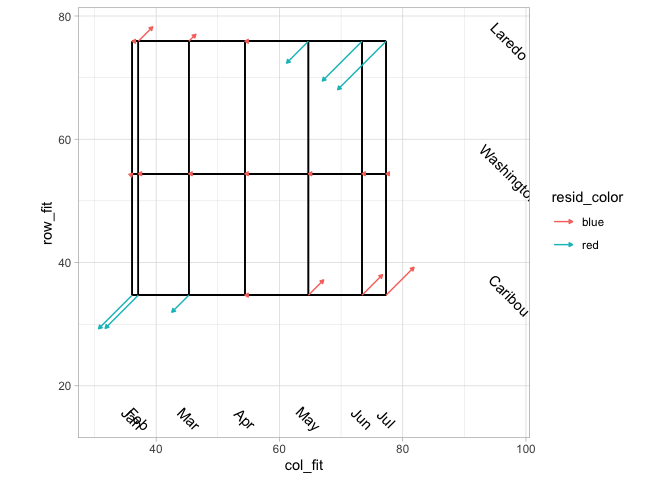

## Libraries

## First steps of a worked example

p 168 from Mosteller and Tukey, *Data Analysis and Regression, A Second
Course in Statistics*, Reading, MA: Addison-Wesley, 1977.

## Median temperature data

Set up the data in R

    med_temp_tibble <- tibble(
      month = c("Jan", "Feb", "Mar", "Apr", "May", "Jun", "Jul"),
      Caribou = c(8.7, 9.8, 21.7, 34.7, 48.5, 58.4, 64.0), 
      Washington = c(36.2, 37.1, 45.3, 54.4, 64.7, 73.4, 77.3), 
      Laredo = c(57.6, 61.9, 68.4, 75.9, 81.2, 85.8, 87.7)
    )

    med_temp_array <- t(med_temp_tibble[,2:4])
    dimnames(med_temp_array)[[2]] <- t(med_temp_tibble[,1])

    med_temp_longer <- med_temp_tibble %>% 
      pivot_longer(cols = c("Caribou", "Washington", "Laredo"), 
                   values_to = "temps" , names_to = "place") %>% 
      mutate(month = factor(month, levels = c("Jan", "Feb", "Mar", "Apr", "May", "Jun", "Jul"), ordered = TRUE))

    array_row_names <- med_temp_array[,1]

## Techniques described by Hadley Wickham

Hadley Wickham, R for Data Science chapter on Exploratory Data Analysis:
<https://r4ds.had.co.nz/exploratory-data-analysis.html> 

### Variant number one

    med_temp_longer %>% ggplot(aes(month, y = place)) +
      geom_point(aes(size = temps)) +
      coord_flip()

### Variant number two

    med_temp_longer %>% ggplot(aes(month, y = place)) +
      geom_tile(mapping = aes(fill = temps)) +
      coord_flip()

## Save medpolish output in a list and demonstrate basic additivity plot

    lp <- medpolish(med_temp_array)

    ## 1: 64
    ## Final: 64

### Standard output

    lp

    ## 
    ## Median Polish Results (Dataset: "med_temp_array")
    ## 
    ## Overall: 54.4
    ## 
    ## Row Effects:
    ##    Caribou Washington     Laredo 
    ##      -19.7        0.0       21.5 
    ## 
    ## Column Effects:
    ##   Jan   Feb   Mar   Apr   May   Jun   Jul 
    ## -18.3 -17.3  -9.1   0.0  10.3  19.0  22.9 
    ## 
    ## Residuals:
    ##             Jan  Feb  Mar Apr  May  Jun   Jul
    ## Caribou    -7.7 -7.6 -3.9   0  3.5  4.7   6.4
    ## Washington  0.1  0.0  0.0   0  0.0  0.0   0.0
    ## Laredo      0.0  3.3  1.6   0 -5.0 -9.1 -11.1

### Additivity plot

## Augment *medpolish* output to produce an augmented plot

Aiming to reproduce the plot on p 176

    lp_row_tibble <- tibble(area = array_row_names)
    fit <- as_tibble(lp$overall + outer(lp$row, lp$col, "+"))
    fit <- bind_cols(lp_row_tibble, fit) # add row-names back to the fit df

    residuals <- bind_cols(lp_row_tibble, lp$residuals)

    max_row_fit <- max(lp$row) + lp$overall
    min_row_fit <- min(lp$row) + lp$overall
    max_col_fit <- max(lp$col) + lp$overall
    min_col_fit <- min(lp$col) + lp$overall

    # Store augmented residuals data frame back in the lp list
    # lp$residuals <- residuals

    long_fit <- pivot_longer(fit,
      cols = where(is.numeric),
      names_to = "cols",
      values_to = "raw_count",
      names_repair = "unique"
    )

    long_resid <- residuals %>%
      pivot_longer(
        cols = names(lp$col), names_to = "treat",
        values_to = "resids"
      )

    overall_fit <- rep(lp$overall, (length(lp$row * length(lp$col))))

    long_fit <- tibble(
      col_fit = (rep(lp$col, times = length(lp$row)) + overall_fit),
      row_fit = (rep(lp$row, each = length(lp$col)) + overall_fit)
    )

    long_fit_resids <- bind_cols(long_fit, long_resid)

    # names(long_fit_resids)

    max_row_fit <- max(c((lp$row + lp$overall)))
    min_row_fit <- min(c((lp$row + lp$overall)))
    max_col_fit <- max(c((lp$col + lp$overall)))
    min_col_fit <- min(c((lp$col + lp$overall)))
    # min_fit <- min(c(lp$row, lp$col))

    table_length <- length(lp$row) * length(lp$col)

    long_fit_resids <- long_fit_resids %>%
      mutate(
        sign = ifelse(resids >= 0, 1, -1),
        seg_length = sqrt((resids**2) / 2),
        col_fit_end = col_fit + (sign * seg_length),
        row_fit_end = row_fit + (sign * seg_length),
        row_grid_start = rep(min_row_fit, table_length),
        row_grid_end = rep(max_row_fit, table_length),
        col_grid_start = rep(min_col_fit, table_length),
        col_grid_end = rep(max_col_fit, table_length),
      ) %>%
      select(-sign)

    row_label_tibble <- tibble(
      row_label_label = names(lp$row),
      row_label_x = (lp$row + lp$overall),
      row_label_y = (rep(max_col_fit, length(lp$row)))
    )

    col_label_tibble <- tibble(
      col_label_label = names(lp$col),
      col_label_x = (lp$col + lp$overall),
      col_label_y = (rep(min_row_fit, length(lp$col)))
    )

    lp$long_fit_resids <- long_fit_resids
    lp$row_label_tibble <- row_label_tibble
    lp$col_label_tibble <- col_label_tibble

## Graph the median polish fit

    p <- lp$long_fit_resids %>%
      mutate(resid_color = case_when(
        resids < 0 ~ "red",
        TRUE ~ "blue"
      )) %>% 
      ggplot(aes(x = col_fit, y = row_fit)) +
      # geom_point() +
      geom_segment(aes(y = row_grid_start, x = col_fit, yend = row_grid_end, xend = col_fit)) +
      geom_segment(aes(y = row_fit, x = col_grid_start, xend = col_grid_end, yend = row_fit)) +
      coord_fixed(ratio = 1) +
      geom_segment(aes(
        x = col_fit, y = row_fit,
        xend = col_fit_end, yend = row_fit_end,
        color = resid_color
      ),
      arrow = arrow(type = "closed", length = unit(.1, "cm"))
      ) +
      geom_text(
        data = col_label_tibble,
        aes(col_label_x, col_label_y,
          label = col_label_label
        ),
        angle = -45,
        nudge_y = -20
      ) +
      geom_text(
        data = row_label_tibble,
        aes(row_label_y, row_label_x,
          label = row_label_label
        ),
        angle = -45,
        nudge_x = 20
      ) +
      labs(fill = NULL)

    p

## Rotate the fit plot

    rotation <- 45
    p_rot <- p +
      theme(
        legend.position = "none",
        axis.title.y = element_text(angle = -90)
      )
    grid.newpage()

    vp <- viewport(name = "rotate", angle = rotation, width = 0.7, height = 0.7)
    pushViewport(vp)
    print(p_rot, vp = "rotate", newpage = FALSE)

    ## Warning in grid.Call.graphics(C_setviewport, vp, TRUE): cannot clip to rotated
    ## viewport

    ## Warning in grid.Call.graphics(C_setviewport, vp, TRUE): cannot clip to rotated
    ## viewport

    vp <- viewport(
      x = 0.15, y = 0.8, width = 0,
      height = 0
    )
    pushViewport(vp)

