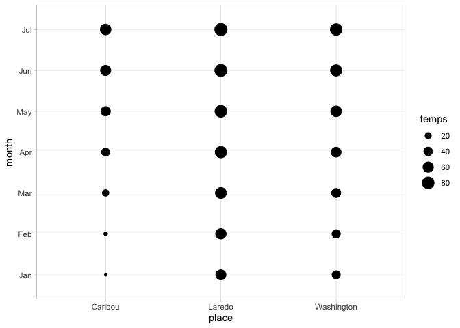

## Libraries

## A classic dataset from Tukey, 1977

    leptinotarsa_d <- read.csv(header = TRUE, text = "
    treat, a1, a2, a3, a4, a5, a6
    one, 492, 410, 475, 895, 401, 330
    two, 111, 67, 233, 218, 28, 18
    three, 58, 267, 283, 279, 392, 141
    four, 4, 1, 53, 14, 138, 11")

    long_lept <- pivot_longer(leptinotarsa_d, cols = where(is.numeric), names_to = "area", values_to = "original_count")

## Two graphs to demonstrate techniques described by Wickham (in press):

### One

    ggplot(data = long_lept) +
      geom_count(mapping = aes(x = treat, y = area))

### Variant of number one

    long_lept %>% ggplot(aes(treat, y = area)) +
      geom_point(aes(size = (original_count))) +
      coord_flip()

### Two

    long_lept %>% 
      ggplot(mapping = aes(x = treat, y = area)) +
        geom_tile(mapping = aes(fill = original_count))

## Format the data so that medpolish function can process

    lp_row_names <- leptinotarsa_d[,1]

    .rowNamesDF(leptinotarsa_d, make.names = FALSE) <- lp_row_names

    has_rownames(leptinotarsa_d)

    ## [1] TRUE

    leptinotarsa_d <- leptinotarsa_d %>%
      select(-1)

## Save medpolish output in a list and demonstrate basic additivity plot

    lp <- medpolish(leptinotarsa_d)

    ## 1: 1567
    ## 2: 1450.25
    ## 3: 1433.125
    ## Final: 1429

    plot(lp)

## Augment *medpolish* output to produce an augmented plot

    lp_row_tibble <- tibble(area = lp_row_names)
    fit <- as_tibble(lp$overall + outer(lp$row, lp$col, "+"))
    fit <- bind_cols(lp_row_tibble, fit) # add row-names back to the fit df

    residuals <- bind_cols(lp_row_tibble, lp$residuals)

    max_row_fit <- max(lp$row) + lp$overall
    min_row_fit <- min(lp$row) + lp$overall
    max_col_fit <- max(lp$col) + lp$overall
    min_col_fit <- min(lp$col) + lp$overall

    # Store augmented residuals data frame back in the lp list
    # lp$residuals <- residuals

    long_fit <- pivot_longer(fit,
      cols = where(is.numeric),
      names_to = "cols",
      values_to = "raw_count",
      names_repair = "unique"
    )

    long_resid <- residuals %>%
      pivot_longer(
        cols = names(lp$col), names_to = "treat",
        values_to = "resids"
      )

    overall_fit <- rep(lp$overall, (length(lp$row * length(lp$col))))

    long_fit <- tibble(
      col_fit = (rep(lp$col, times = length(lp$row)) + overall_fit),
      row_fit = (rep(lp$row, each = length(lp$col)) + overall_fit)
    )

    long_fit_resids <- bind_cols(long_fit, long_resid)

    # names(long_fit_resids)

    max_row_fit <- max(c((lp$row + lp$overall)))
    min_row_fit <- min(c((lp$row + lp$overall)))
    max_col_fit <- max(c((lp$col + lp$overall)))
    min_col_fit <- min(c((lp$col + lp$overall)))
    # min_fit <- min(c(lp$row, lp$col))

    table_length <- length(lp$row) * length(lp$col)

    long_fit_resids <- long_fit_resids %>%
      mutate(
        sign = ifelse(resids >= 0, 1, -1),
        seg_length = sqrt((resids**2) / 2),
        col_fit_end = col_fit + (sign * seg_length),
        row_fit_end = row_fit + (sign * seg_length),
        row_grid_start = rep(min_row_fit, table_length),
        row_grid_end = rep(max_row_fit, table_length),
        col_grid_start = rep(min_col_fit, table_length),
        col_grid_end = rep(max_col_fit, table_length),
      ) %>%
      select(-sign)

    row_label_tibble <- tibble(
      row_label_label = names(lp$row),
      row_label_x = (lp$row + lp$overall),
      row_label_y = (rep(max_col_fit, length(lp$row)))
    )

    col_label_tibble <- tibble(
      col_label_label = names(lp$col),
      col_label_x = (lp$col + lp$overall),
      col_label_y = (rep(min_row_fit, length(lp$col)))
    )

    lp$long_fit_resids <- long_fit_resids
    lp$row_label_tibble <- row_label_tibble
    lp$col_label_tibble <- col_label_tibble

## Graph the median polish fit

    p <- lp$long_fit_resids %>%
      ggplot(aes(x = col_fit, y = row_fit)) +
      # geom_point() +
      geom_segment(aes(y = row_grid_start, x = col_fit, yend = row_grid_end, xend = col_fit)) +
      geom_segment(aes(y = row_fit, x = col_grid_start, xend = col_grid_end, yend = row_fit)) +
      coord_fixed(ratio = 1) +
      geom_segment(aes(
        x = col_fit, y = row_fit,
        xend = col_fit_end, yend = row_fit_end,
        color = resids
      ),
      arrow = arrow(type = "closed", length = unit(.1, "cm"))
      ) +
      geom_text(
        data = col_label_tibble,
        aes(col_label_x, col_label_y,
          label = col_label_label
        ),
        angle = -45,
        nudge_y = -20
      ) +
      geom_text(
        data = row_label_tibble,
        aes(row_label_y, row_label_x,
          label = row_label_label
        ),
        angle = -45,
        nudge_x = 20
      )

    p

## Rotate the fit plot for easier viewing

    rotation <- 45
    leg <- as.grob(~ plot(get_legend(p + theme_void())))
    p_rot <- p +
      theme(
        legend.position = "none",
        axis.title.y = element_text(angle = -90)
      )
    grid.newpage()

    vp <- viewport(name = "rotate", angle = rotation, width = 0.7, height = 0.7)
    pushViewport(vp)
    print(p_rot, vp = "rotate", newpage = FALSE)

    ## Warning in grid.Call.graphics(C_setviewport, vp, TRUE): cannot clip to rotated
    ## viewport

    ## Warning in grid.Call.graphics(C_setviewport, vp, TRUE): cannot clip to rotated
    ## viewport

    vp <- viewport(
      x = 0.15, y = 0.8, width = 0,
      height = 0
    )
    pushViewport(vp)
    grid.draw(leg)

